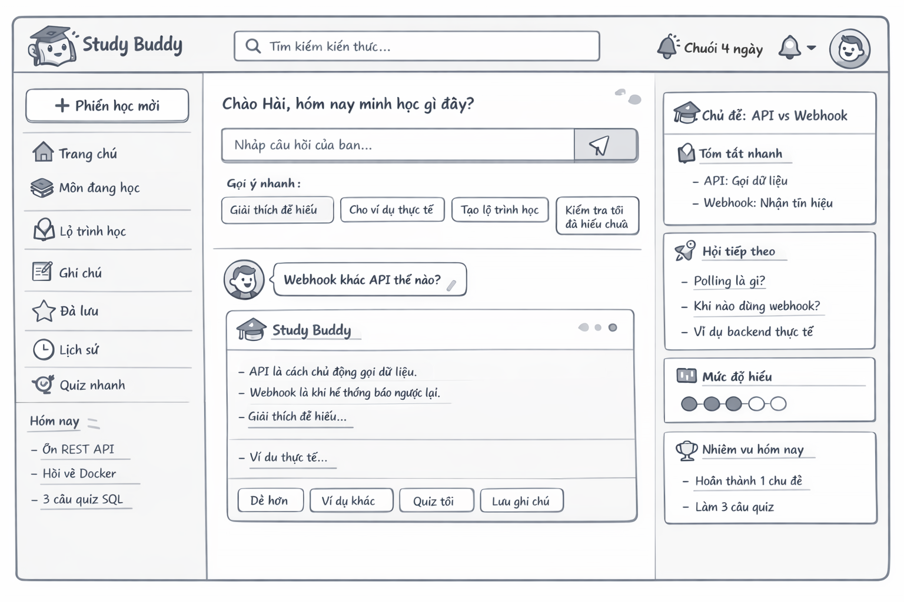

**[Ý tưởng UI]**

https://chatgpt.com/share/69e2d90e-7fc4-839b-843c-8f4d92eb6ae3

# 1
giao diện của một trang web với vai trò là trợ lý để giúp người dùng tiếp thu tri thức, có thể trả lời, hướng dẫn gợi ý và hỗ trợ giải đáp thắc mắc. cần thiết như thế nào để có ui và ux tốt dễ sử dụng, không bị nhàm chán

````
Đây là một bản phác thảo UI theo hướng **trợ lý học tập / trợ lý tri thức**, tập trung vào **dễ dùng, rõ ràng, không nhàm chán**.

---

# 1. Ý tưởng tổng thể

Phong cách nên đi theo hướng:

* sạch
* hiện đại
* thân thiện
* ít chi tiết thừa
* tạo cảm giác đang được một trợ lý đồng hành học tập

Tư duy chính:

* **ở giữa là nơi tương tác chính**
* **bên trái là điều hướng**
* **bên phải là hỗ trợ ngữ cảnh học tập**
* **mọi thứ phải phục vụ việc hiểu nhanh và hỏi tiếp dễ dàng**

---

# 2. Bố cục tổng thể

## Khung 3 cột

```text
┌──────────────────────────────────────────────────────────────────────────────┐
│ Header                                                                       │
├───────────────┬──────────────────────────────────────┬───────────────────────┤
│ Sidebar trái  │ Khu vực chat / học tập chính         │ Panel hỗ trợ bên phải │
│               │                                      │                       │
│ - Trang chủ   │ - lời chào                           │ - Chủ đề đang học     │
│ - Lộ trình    │ - khung nhập câu hỏi                 │ - Tóm tắt ngắn        │
│ - Lịch sử     │ - câu trả lời assistant              │ - Gợi ý tiếp theo     │
│ - Đã lưu      │ - ví dụ / quiz / gợi ý               │ - Mức độ hiểu         │
│ - Ghi chú     │ - hành động nhanh                    │ - Tài liệu liên quan  │
└───────────────┴──────────────────────────────────────┴───────────────────────┘
```

---

# 3. Phác thảo từng vùng

## A. Header trên cùng

```text
┌──────────────────────────────────────────────────────────────────────────────┐
│ Logo | Học cùng trợ lý | [Tìm kiếm...]      | Thông báo | Hồ sơ người dùng   │
└──────────────────────────────────────────────────────────────────────────────┘
```

### Thành phần nên có:

* **Logo + tên sản phẩm**
* **ô tìm kiếm toàn cục**
* **nút tạo phiên học mới**
* **avatar người dùng**
* có thể thêm:

  * chuyển chế độ sáng/tối
  * chọn phong cách trả lời: ngắn / dễ hiểu / chuyên sâu

### Vai trò UX:

* giúp người dùng luôn biết mình đang ở đâu
* tìm lại nội dung cũ nhanh
* không cần đào sâu menu

---

## B. Sidebar trái

Sidebar trái nên cố định, gọn, dễ quét.

```text
┌──────────────────────┐
│ + Phiên học mới      │
│                      │
│ Trang chủ            │
│ Lộ trình học         │
│ Chủ đề của tôi       │
│ Lịch sử hội thoại    │
│ Đã lưu               │
│ Ghi chú              │
│ Cài đặt              │
│                      │
│ ------------------   │
│ Gần đây              │
│ - REST API cơ bản    │
│ - Docker là gì       │
│ - Học SQL từng bước  │
└──────────────────────┘
```

### Vai trò UX:

* điều hướng rõ ràng
* giúp người dùng quay lại nội dung cũ
* tạo cảm giác “đây là không gian học tập”, không phải chat một lần rồi mất

---

## C. Khu vực chính ở giữa

Đây là phần quan trọng nhất.

## 1) Trạng thái khi mới vào trang

```text
┌──────────────────────────────────────────────────────┐
│ Xin chào, hôm nay bạn muốn tìm hiểu điều gì?         │
│ [ Nhập câu hỏi của bạn...                      ]      │
│                                                      │
│ Gợi ý nhanh:                                         │
│ [Giải thích khái niệm] [Cho ví dụ thực tế]           │
│ [Tạo lộ trình học] [Kiểm tra tôi đã hiểu chưa]       │
│ [Tóm tắt ngắn gọn] [So sánh hai khái niệm]           │
└──────────────────────────────────────────────────────┘
```

### Điểm quan trọng:

Không để trang quá trống. Phải có gợi ý sẵn để người dùng không bị bí.

---

## 2) Khi đã có hội thoại

Nội dung chat nên theo dạng **card**, không phải một khối văn bản dài vô tận.

### Tin nhắn người dùng

```text
                         ┌──────────────────────────────┐
                         │ API khác gì với Webhook?     │
                         └──────────────────────────────┘
```

### Tin nhắn trợ lý

```text
┌─────────────────────────────────────────────────────────────────────┐
│ Trợ lý                                                             │
│                                                                     │
│ API là cách một hệ thống chủ động gửi/yêu cầu dữ liệu.              │
│ Webhook là cách hệ thống tự động báo về khi có sự kiện xảy ra.      │
│                                                                     │
│ Giải thích đơn giản hơn                                             │
│ API giống như bạn gọi điện hỏi thông tin.                           │
│ Webhook giống như bên kia tự gọi cho bạn khi có tin mới.           │
│                                                                     │
│ Ví dụ thực tế                                                       │
│ - API: app gọi server để lấy danh sách đơn hàng                     │
│ - Webhook: server báo về khi đơn hàng đổi trạng thái                │
│                                                                     │
│ [Giải thích dễ hơn] [Cho ví dụ khác] [So sánh sâu hơn]              │
│ [Kiểm tra tôi đã hiểu chưa] [Tạo sơ đồ]                             │
└─────────────────────────────────────────────────────────────────────┘
```

### Điểm mạnh UX:

* câu trả lời dễ quét
* có nhiều mức đào sâu
* người dùng không cần gõ lại từ đầu cho các nhu cầu tiếp theo

---

## D. Panel phải hỗ trợ học tập

Panel này giúp sản phẩm khác biệt với chatbot thường.

```text
┌──────────────────────────────┐
│ Chủ đề hiện tại              │
│ API và Webhook               │
│                              │
│ Tóm tắt nhanh                │
│ - API: chủ động gọi          │
│ - Webhook: nhận tín hiệu     │
│                              │
│ Bạn có thể hỏi tiếp          │
│ - Khi nào nên dùng webhook?  │
│ - API polling là gì?         │
│ - Ví dụ backend thực tế      │
│                              │
│ Mức độ hiểu hiện tại         │
│ [●●●○○]                      │
│                              │
│ Ghi chú cá nhân              │
│ [................................] │
│                              │
│ Lưu chủ đề   Tạo quiz        │
└──────────────────────────────┘
```

### Vai trò UX:

* giữ ngữ cảnh học tập
* gợi mở thay vì bắt người dùng tự nghĩ mọi câu hỏi
* tạo cảm giác có tiến trình

---

# 4. Luồng trải nghiệm người dùng

## Luồng chuẩn

### Bước 1: vào trang

Người dùng thấy:

* lời chào
* ô nhập lớn
* các gợi ý có sẵn

### Bước 2: nhập câu hỏi

Ví dụ:
“Giải thích Docker cho người mới”

### Bước 3: hệ thống trả lời theo tầng

* trả lời ngắn
* giải thích dễ hiểu
* ví dụ thực tế
* câu hỏi tiếp nối

### Bước 4: người dùng không cần gõ lại quá nhiều

Có thể bấm:

* cho ví dụ khác
* giải thích chuyên sâu
* hỏi lại tôi để kiểm tra
* tạo lộ trình học tiếp

### Bước 5: kết thúc phiên

Hệ thống gợi ý:

* lưu chủ đề
* đánh dấu đã hiểu
* tạo 3 câu ôn tập nhanh

---

# 5. Phong cách hình ảnh nên đi theo

## Màu sắc

Nên dùng:

* nền sáng hoặc hơi ngả xám rất nhẹ
* 1 màu chính dịu như xanh lam / tím nhạt / xanh ngọc
* màu nhấn cho nút CTA
* màu cảnh báo và trạng thái phải rõ nhưng ít dùng

Ví dụ:

* nền: trắng / xám rất nhạt
* primary: xanh dương hiện đại
* accent: tím nhạt hoặc xanh mint

## Typography

* font sans-serif hiện đại
* chữ vừa phải, không quá bé
* line-height thoáng
* tiêu đề rõ cấp bậc

## Hình khối

* bo góc mềm
* card rõ ràng
* shadow nhẹ
* icon tối giản

---

# 6. Những thành phần nên có để tránh nhàm chán

Không phải thêm nhiều hiệu ứng, mà thêm **điểm tương tác thông minh**:

## a. Quick actions dưới mỗi câu trả lời

Ví dụ:

* giải thích ngắn hơn
* ví dụ dễ hiểu hơn
* hỏi lại tôi
* so sánh
* tạo flashcard

## b. Chế độ học

Cho người dùng chọn:

* học nhanh
* học kỹ
* luyện phỏng vấn
* ôn tập
* giải thích như cho người mới

## c. Mini quiz

Sau mỗi chủ đề:

* 1 câu hỏi trắc nghiệm
* 1 câu hỏi ngắn
* 1 bài tập nhỏ

## d. Thành tựu nhẹ

Không game hóa quá mức, nhưng có thể có:

* đã học 3 chủ đề hôm nay
* hoàn thành lộ trình cơ bản
* đã ôn lại 2 lần

---

# 7. Wireframe chi tiết hơn

## Trang chính

```text
┌──────────────────────────────────────────────────────────────────────────────┐
│ Logo | Trợ lý tri thức | [Tìm kiếm kiến thức...] | + Phiên mới | Avatar     │
├───────────────┬──────────────────────────────────────────────┬──────────────┤
│               │                                              │              │
│ + Phiên mới   │  Xin chào Hải, hôm nay bạn muốn học gì?      │ Chủ đề hiện  │
│               │                                              │ tại          │
│ Trang chủ     │  [ Nhập câu hỏi của bạn...              ]    │ - Chưa có    │
│ Lộ trình      │                                              │              │
│ Lịch sử       │  Gợi ý nhanh:                                │ Gợi ý        │
│ Đã lưu        │  [Giải thích khái niệm] [Tạo lộ trình]       │ - Hỏi một    │
│ Ghi chú       │  [Cho ví dụ] [Kiểm tra hiểu bài]             │   chủ đề mới │
│               │                                              │              │
│ Gần đây       │                                              │              │
│ - AI agent    │                                              │              │
│ - Fine-tune   │                                              │              │
│ - Memvid      │                                              │              │
│               │                                              │              │
└───────────────┴──────────────────────────────────────────────┴──────────────┘
```

---

## Sau khi có hội thoại

```text
┌──────────────────────────────────────────────────────────────────────────────┐
│ Logo | Trợ lý tri thức | [Tìm kiếm...] | + Phiên mới | Avatar              │
├───────────────┬──────────────────────────────────────────────┬──────────────┤
│ Sidebar       │                                              │ Panel phải   │
│               │  Người dùng:                                 │              │
│ Lộ trình      │  "Webhook khác gì API?"                      │ Chủ đề       │
│ Lịch sử       │                                              │ API/Webhook  │
│ Đã lưu        │  Trợ lý:                                     │              │
│               │  API là cách chủ động gọi dữ liệu...         │ Tóm tắt      │
│ Gần đây       │  Webhook là cách hệ thống báo ngược lại...   │ - API gọi ra │
│ - Docker      │                                              │ - Webhook    │
│ - SQL         │  Ví dụ thực tế                               │   báo vào    │
│ - REST API    │  ...                                         │              │
│               │                                              │ Hỏi tiếp     │
│               │  [Ví dụ khác] [Dễ hơn] [Quiz] [Lộ trình]     │ - Polling là │
│               │                                              │   gì?        │
│               │                                              │ - Dùng khi   │
│               │                                              │   nào?       │
│               │                                              │              │
│               │  [ Nhập câu hỏi tiếp theo...           ]     │ Tiến độ 60%  │
└───────────────┴──────────────────────────────────────────────┴──────────────┘
```

---

# 8. Mobile nên chuyển thế nào

Trên mobile không nên giữ 3 cột.

## Mobile layout:

* header gọn
* chat chiếm toàn bộ màn hình
* sidebar trái thành menu trượt
* panel phải thành bottom sheet hoặc tab phụ

### Cấu trúc:

* Tab 1: Chat
* Tab 2: Lộ trình
* Tab 3: Đã lưu
* Tab 4: Hồ sơ

Như vậy sẽ dễ dùng hơn nhiều.

---

# 9. MVP tối thiểu nên có gì

Nếu bạn muốn làm bản đầu tiên nhanh để thử nghiệm, chỉ cần:

## Bắt buộc

* header đơn giản
* sidebar trái
* khu vực chat chính
* gợi ý nhanh
* card câu trả lời có nút hành động
* panel phải chứa tóm tắt + gợi ý tiếp theo

## Chưa cần ngay

* gamification phức tạp
* animation nặng
* dashboard quá chi tiết
* quá nhiều chế độ học

---

# 10. Kết luận ngắn gọn

Bản phác thảo tốt nhất cho ý tưởng của bạn là:

* **trái:** điều hướng và lịch sử
* **giữa:** chat học tập có cấu trúc
* **phải:** ngữ cảnh, tiến độ, gợi ý tiếp theo

Khác biệt lớn nhất so với chatbot thường là:

* không chỉ trả lời
* mà còn dẫn dắt
* ghi nhớ tiến trình
* hỗ trợ học tiếp từng bước

Tôi có thể phác tiếp cho bạn theo 1 trong 2 hướng:
**phong cách hiện đại kiểu Notion/ChatGPT** hoặc **phong cách sinh động hơn như trợ lý học tập cho sinh viên**.

````

# 2
phác thảo giúp tôi
````
Đây là một bản phác thảo UI theo hướng **trợ lý học tập / trợ lý tri thức**, tập trung vào **dễ dùng, rõ ràng, không nhàm chán**.

---

# 1. Ý tưởng tổng thể

Phong cách nên đi theo hướng:

* sạch
* hiện đại
* thân thiện
* ít chi tiết thừa
* tạo cảm giác đang được một trợ lý đồng hành học tập

Tư duy chính:

* **ở giữa là nơi tương tác chính**
* **bên trái là điều hướng**
* **bên phải là hỗ trợ ngữ cảnh học tập**
* **mọi thứ phải phục vụ việc hiểu nhanh và hỏi tiếp dễ dàng**

---

# 2. Bố cục tổng thể

## Khung 3 cột

```text
┌──────────────────────────────────────────────────────────────────────────────┐
│ Header                                                                       │
├───────────────┬──────────────────────────────────────┬───────────────────────┤
│ Sidebar trái  │ Khu vực chat / học tập chính         │ Panel hỗ trợ bên phải │
│               │                                      │                       │
│ - Trang chủ   │ - lời chào                           │ - Chủ đề đang học     │
│ - Lộ trình    │ - khung nhập câu hỏi                 │ - Tóm tắt ngắn        │
│ - Lịch sử     │ - câu trả lời assistant              │ - Gợi ý tiếp theo     │
│ - Đã lưu      │ - ví dụ / quiz / gợi ý               │ - Mức độ hiểu         │
│ - Ghi chú     │ - hành động nhanh                    │ - Tài liệu liên quan  │
└───────────────┴──────────────────────────────────────┴───────────────────────┘
```

---

# 3. Phác thảo từng vùng

## A. Header trên cùng

```text
┌──────────────────────────────────────────────────────────────────────────────┐
│ Logo | Học cùng trợ lý | [Tìm kiếm...]      | Thông báo | Hồ sơ người dùng   │
└──────────────────────────────────────────────────────────────────────────────┘
```

### Thành phần nên có:

* **Logo + tên sản phẩm**
* **ô tìm kiếm toàn cục**
* **nút tạo phiên học mới**
* **avatar người dùng**
* có thể thêm:

  * chuyển chế độ sáng/tối
  * chọn phong cách trả lời: ngắn / dễ hiểu / chuyên sâu

### Vai trò UX:

* giúp người dùng luôn biết mình đang ở đâu
* tìm lại nội dung cũ nhanh
* không cần đào sâu menu

---

## B. Sidebar trái

Sidebar trái nên cố định, gọn, dễ quét.

```text
┌──────────────────────┐
│ + Phiên học mới      │
│                      │
│ Trang chủ            │
│ Lộ trình học         │
│ Chủ đề của tôi       │
│ Lịch sử hội thoại    │
│ Đã lưu               │
│ Ghi chú              │
│ Cài đặt              │
│                      │
│ ------------------   │
│ Gần đây              │
│ - REST API cơ bản    │
│ - Docker là gì       │
│ - Học SQL từng bước  │
└──────────────────────┘
```

### Vai trò UX:

* điều hướng rõ ràng
* giúp người dùng quay lại nội dung cũ
* tạo cảm giác “đây là không gian học tập”, không phải chat một lần rồi mất

---

## C. Khu vực chính ở giữa

Đây là phần quan trọng nhất.

## 1) Trạng thái khi mới vào trang

```text
┌──────────────────────────────────────────────────────┐
│ Xin chào, hôm nay bạn muốn tìm hiểu điều gì?         │
│ [ Nhập câu hỏi của bạn...                      ]      │
│                                                      │
│ Gợi ý nhanh:                                         │
│ [Giải thích khái niệm] [Cho ví dụ thực tế]           │
│ [Tạo lộ trình học] [Kiểm tra tôi đã hiểu chưa]       │
│ [Tóm tắt ngắn gọn] [So sánh hai khái niệm]           │
└──────────────────────────────────────────────────────┘
```

### Điểm quan trọng:

Không để trang quá trống. Phải có gợi ý sẵn để người dùng không bị bí.

---

## 2) Khi đã có hội thoại

Nội dung chat nên theo dạng **card**, không phải một khối văn bản dài vô tận.

### Tin nhắn người dùng

```text
                         ┌──────────────────────────────┐
                         │ API khác gì với Webhook?     │
                         └──────────────────────────────┘
```

### Tin nhắn trợ lý

```text
┌─────────────────────────────────────────────────────────────────────┐
│ Trợ lý                                                             │
│                                                                     │
│ API là cách một hệ thống chủ động gửi/yêu cầu dữ liệu.              │
│ Webhook là cách hệ thống tự động báo về khi có sự kiện xảy ra.      │
│                                                                     │
│ Giải thích đơn giản hơn                                             │
│ API giống như bạn gọi điện hỏi thông tin.                           │
│ Webhook giống như bên kia tự gọi cho bạn khi có tin mới.           │
│                                                                     │
│ Ví dụ thực tế                                                       │
│ - API: app gọi server để lấy danh sách đơn hàng                     │
│ - Webhook: server báo về khi đơn hàng đổi trạng thái                │
│                                                                     │
│ [Giải thích dễ hơn] [Cho ví dụ khác] [So sánh sâu hơn]              │
│ [Kiểm tra tôi đã hiểu chưa] [Tạo sơ đồ]                             │
└─────────────────────────────────────────────────────────────────────┘
```

### Điểm mạnh UX:

* câu trả lời dễ quét
* có nhiều mức đào sâu
* người dùng không cần gõ lại từ đầu cho các nhu cầu tiếp theo

---

## D. Panel phải hỗ trợ học tập

Panel này giúp sản phẩm khác biệt với chatbot thường.

```text
┌──────────────────────────────┐
│ Chủ đề hiện tại              │
│ API và Webhook               │
│                              │
│ Tóm tắt nhanh                │
│ - API: chủ động gọi          │
│ - Webhook: nhận tín hiệu     │
│                              │
│ Bạn có thể hỏi tiếp          │
│ - Khi nào nên dùng webhook?  │
│ - API polling là gì?         │
│ - Ví dụ backend thực tế      │
│                              │
│ Mức độ hiểu hiện tại         │
│ [●●●○○]                      │
│                              │
│ Ghi chú cá nhân              │
│ [................................] │
│                              │
│ Lưu chủ đề   Tạo quiz        │
└──────────────────────────────┘
```

### Vai trò UX:

* giữ ngữ cảnh học tập
* gợi mở thay vì bắt người dùng tự nghĩ mọi câu hỏi
* tạo cảm giác có tiến trình

---

# 4. Luồng trải nghiệm người dùng

## Luồng chuẩn

### Bước 1: vào trang

Người dùng thấy:

* lời chào
* ô nhập lớn
* các gợi ý có sẵn

### Bước 2: nhập câu hỏi

Ví dụ:
“Giải thích Docker cho người mới”

### Bước 3: hệ thống trả lời theo tầng

* trả lời ngắn
* giải thích dễ hiểu
* ví dụ thực tế
* câu hỏi tiếp nối

### Bước 4: người dùng không cần gõ lại quá nhiều

Có thể bấm:

* cho ví dụ khác
* giải thích chuyên sâu
* hỏi lại tôi để kiểm tra
* tạo lộ trình học tiếp

### Bước 5: kết thúc phiên

Hệ thống gợi ý:

* lưu chủ đề
* đánh dấu đã hiểu
* tạo 3 câu ôn tập nhanh

---

# 5. Phong cách hình ảnh nên đi theo

## Màu sắc

Nên dùng:

* nền sáng hoặc hơi ngả xám rất nhẹ
* 1 màu chính dịu như xanh lam / tím nhạt / xanh ngọc
* màu nhấn cho nút CTA
* màu cảnh báo và trạng thái phải rõ nhưng ít dùng

Ví dụ:

* nền: trắng / xám rất nhạt
* primary: xanh dương hiện đại
* accent: tím nhạt hoặc xanh mint

## Typography

* font sans-serif hiện đại
* chữ vừa phải, không quá bé
* line-height thoáng
* tiêu đề rõ cấp bậc

## Hình khối

* bo góc mềm
* card rõ ràng
* shadow nhẹ
* icon tối giản

---

# 6. Những thành phần nên có để tránh nhàm chán

Không phải thêm nhiều hiệu ứng, mà thêm **điểm tương tác thông minh**:

## a. Quick actions dưới mỗi câu trả lời

Ví dụ:

* giải thích ngắn hơn
* ví dụ dễ hiểu hơn
* hỏi lại tôi
* so sánh
* tạo flashcard

## b. Chế độ học

Cho người dùng chọn:

* học nhanh
* học kỹ
* luyện phỏng vấn
* ôn tập
* giải thích như cho người mới

## c. Mini quiz

Sau mỗi chủ đề:

* 1 câu hỏi trắc nghiệm
* 1 câu hỏi ngắn
* 1 bài tập nhỏ

## d. Thành tựu nhẹ

Không game hóa quá mức, nhưng có thể có:

* đã học 3 chủ đề hôm nay
* hoàn thành lộ trình cơ bản
* đã ôn lại 2 lần

---

# 7. Wireframe chi tiết hơn

## Trang chính

```text
┌──────────────────────────────────────────────────────────────────────────────┐
│ Logo | Trợ lý tri thức | [Tìm kiếm kiến thức...] | + Phiên mới | Avatar     │
├───────────────┬──────────────────────────────────────────────┬──────────────┤
│               │                                              │              │
│ + Phiên mới   │  Xin chào Hải, hôm nay bạn muốn học gì?      │ Chủ đề hiện  │
│               │                                              │ tại          │
│ Trang chủ     │  [ Nhập câu hỏi của bạn...              ]    │ - Chưa có    │
│ Lộ trình      │                                              │              │
│ Lịch sử       │  Gợi ý nhanh:                                │ Gợi ý        │
│ Đã lưu        │  [Giải thích khái niệm] [Tạo lộ trình]       │ - Hỏi một    │
│ Ghi chú       │  [Cho ví dụ] [Kiểm tra hiểu bài]             │   chủ đề mới │
│               │                                              │              │
│ Gần đây       │                                              │              │
│ - AI agent    │                                              │              │
│ - Fine-tune   │                                              │              │
│ - Memvid      │                                              │              │
│               │                                              │              │
└───────────────┴──────────────────────────────────────────────┴──────────────┘
```

---

## Sau khi có hội thoại

```text
┌──────────────────────────────────────────────────────────────────────────────┐
│ Logo | Trợ lý tri thức | [Tìm kiếm...] | + Phiên mới | Avatar              │
├───────────────┬──────────────────────────────────────────────┬──────────────┤
│ Sidebar       │                                              │ Panel phải   │
│               │  Người dùng:                                 │              │
│ Lộ trình      │  "Webhook khác gì API?"                      │ Chủ đề       │
│ Lịch sử       │                                              │ API/Webhook  │
│ Đã lưu        │  Trợ lý:                                     │              │
│               │  API là cách chủ động gọi dữ liệu...         │ Tóm tắt      │
│ Gần đây       │  Webhook là cách hệ thống báo ngược lại...   │ - API gọi ra │
│ - Docker      │                                              │ - Webhook    │
│ - SQL         │  Ví dụ thực tế                               │   báo vào    │
│ - REST API    │  ...                                         │              │
│               │                                              │ Hỏi tiếp     │
│               │  [Ví dụ khác] [Dễ hơn] [Quiz] [Lộ trình]     │ - Polling là │
│               │                                              │   gì?        │
│               │                                              │ - Dùng khi   │
│               │                                              │   nào?       │
│               │                                              │              │
│               │  [ Nhập câu hỏi tiếp theo...           ]     │ Tiến độ 60%  │
└───────────────┴──────────────────────────────────────────────┴──────────────┘
```

---

# 8. Mobile nên chuyển thế nào

Trên mobile không nên giữ 3 cột.

## Mobile layout:

* header gọn
* chat chiếm toàn bộ màn hình
* sidebar trái thành menu trượt
* panel phải thành bottom sheet hoặc tab phụ

### Cấu trúc:

* Tab 1: Chat
* Tab 2: Lộ trình
* Tab 3: Đã lưu
* Tab 4: Hồ sơ

Như vậy sẽ dễ dùng hơn nhiều.

---

# 9. MVP tối thiểu nên có gì

Nếu bạn muốn làm bản đầu tiên nhanh để thử nghiệm, chỉ cần:

## Bắt buộc

* header đơn giản
* sidebar trái
* khu vực chat chính
* gợi ý nhanh
* card câu trả lời có nút hành động
* panel phải chứa tóm tắt + gợi ý tiếp theo

## Chưa cần ngay

* gamification phức tạp
* animation nặng
* dashboard quá chi tiết
* quá nhiều chế độ học

---

# 10. Kết luận ngắn gọn

Bản phác thảo tốt nhất cho ý tưởng của bạn là:

* **trái:** điều hướng và lịch sử
* **giữa:** chat học tập có cấu trúc
* **phải:** ngữ cảnh, tiến độ, gợi ý tiếp theo

Khác biệt lớn nhất so với chatbot thường là:

* không chỉ trả lời
* mà còn dẫn dắt
* ghi nhớ tiến trình
* hỗ trợ học tiếp từng bước

Tôi có thể phác tiếp cho bạn theo 1 trong 2 hướng:
**phong cách hiện đại kiểu Notion/ChatGPT** hoặc **phong cách sinh động hơn như trợ lý học tập cho sinh viên**.

````

# 3
phong cách sinh động hơn như trợ lý học tập cho sinh viên.

````
[](https://storage.googleapis.com/dfmkiidhikclce/interface-learning-design.html?utm_source=chatgpt.com)

Rất hợp. Nếu đi theo hướng **sinh động như trợ lý học tập cho sinh viên**, thì nên làm kiểu **playful but disciplined**: tươi, thân thiện, có cảm giác tiến bộ mỗi ngày, nhưng không trẻ con quá. Lý do là sản phẩm học tập cần vừa tạo hứng thú, vừa giảm tải nhận thức; UX tốt nên giúp người dùng hiểu nhanh, tập trung vào bước tiếp theo, và không bị ngợp. ([IxDF - Interaction Design Foundation][1])

## Concept tổng thể

**Tên phong cách:** Study Buddy / Campus Assistant

**Cảm giác muốn tạo ra:**

* như một người bạn học thông minh
* khuyến khích hỏi tiếp
* học có nhịp, có tiến bộ
* vui mắt nhưng sạch
* gần gũi với sinh viên, không quá “corporate”

## Hướng hình ảnh

Dùng nền sáng, card bo góc lớn, icon mềm, minh hoạ nhẹ, màu pastel có điểm nhấn đậm. Các microinteraction và motion chỉ nên dùng để phản hồi thao tác, không nên làm để “trình diễn”, vì animation có ích nhất khi nó cho người dùng biết điều gì vừa xảy ra hoặc bước tiếp theo là gì. ([Nielsen Norman Group][2])

## Bảng màu gợi ý

Nên chọn 1 màu chính và 2–3 màu phụ vui mắt:

* Primary: tím xanh hoặc xanh dương tươi
* Secondary: hồng pastel / vàng kem / xanh mint
* Background: trắng ngà hoặc xám tím rất nhạt
* Success/progress: xanh lá dịu
* Warning: cam mềm

Ví dụ palette:

* `#6C63FF`
* `#8FD3FE`
* `#FFD166`
* `#FF9ECF`
* `#F7F7FB`

Cách này hợp với UI giáo dục sinh động như nhiều mẫu dashboard học tập hiện nay, nhưng vẫn phải giữ phân cấp rõ ràng để tránh rối. ([IxDF - Interaction Design Foundation][1])

## Typography

* Tiêu đề: đậm, tròn, thân thiện
* Nội dung: sans-serif dễ đọc
* Chữ không quá nhỏ
* Khoảng cách dòng thoáng

Với sản phẩm học tập, tính readable rất quan trọng; chuẩn WCAG cũng nhấn mạnh nội dung cần dễ đọc, dễ hiểu, và hỗ trợ người dùng có khác biệt về khả năng đọc. ([W3C][3])

---

# Phác thảo giao diện

## 1. Header

```text
┌──────────────────────────────────────────────────────────────────────────────┐
│ Logo + tên app     [Tìm chủ đề, câu hỏi, ghi chú...]    🔔   🔥 streak  👤  │
└──────────────────────────────────────────────────────────────────────────────┘
```

Điểm nhấn:

* logo dễ thương, có thể là biểu tượng cuốn sách + tia sáng
* có streak nhỏ “Học 4 ngày liên tiếp”
* avatar người dùng có mood nhẹ như 🙂 📚

---

## 2. Sidebar trái

```text
┌──────────────────────┐
│ + Phiên học mới      │
│                      │
│ 🏠 Trang chủ         │
│ 📚 Môn đang học      │
│ 🗺️ Lộ trình          │
│ 📝 Ghi chú           │
│ ⭐ Đã lưu            │
│ 🕘 Lịch sử           │
│ 🎯 Quiz nhanh        │
│                      │
│ Hôm nay              │
│ - Ôn REST API        │
│ - Hỏi về Docker      │
│ - 3 câu quiz SQL     │
└──────────────────────┘
```

Sidebar nên vui mắt bằng icon và nhãn gần gũi, nhưng bố cục phải quen thuộc để khớp mental model của người dùng. ([IxDF - Interaction Design Foundation][4])

---

## 3. Khu vực trung tâm: hero khi mới vào

```text
┌──────────────────────────────────────────────────────────────┐
│ 👋 Chào Hải, hôm nay mình học gì đây?                        │
│                                                              │
│ [ Hỏi một câu để bắt đầu...                            ]     │
│                                                              │
│ Gợi ý nhanh                                                  │
│ [Giải thích dễ hiểu] [Cho ví dụ thực tế] [Tạo lộ trình]      │
│ [Hỏi lại để kiểm tra] [Tóm tắt 3 ý chính] [Quiz 5 phút]      │
│                                                              │
│ 🔥 Bạn đang có streak 4 ngày học liên tiếp                  │
└──────────────────────────────────────────────────────────────┘
```

Phần này rất quan trọng vì nó giảm cảm giác “trang trống”. Progressive disclosure nên được dùng mạnh ở đây: cho người dùng bắt đầu bằng vài lựa chọn rõ ràng thay vì bắt họ nghĩ mọi thứ từ số 0. ([IxDF - Interaction Design Foundation][5])

---

## 4. Khi đã có hội thoại

### Tin nhắn người dùng

```text
                         ┌──────────────────────────────┐
                         │ Webhook khác API thế nào?    │
                         └──────────────────────────────┘
```

### Card trả lời của trợ lý

```text
┌────────────────────────────────────────────────────────────────────┐
│ 🤖 Study Buddy                                                    │
│                                                                    │
│ Ngắn gọn:                                                          │
│ API là bạn chủ động hỏi. Webhook là hệ thống chủ động báo.         │
│                                                                    │
│ Giải thích dễ hiểu                                                 │
│ API giống như bạn gọi hỏi điểm thi.                                │
│ Webhook giống như trường tự gửi thông báo khi có kết quả.          │
│                                                                    │
│ Ví dụ thực tế                                                      │
│ - App gọi API để lấy đơn hàng                                      │
│ - Server gửi webhook khi đơn hàng đổi trạng thái                   │
│                                                                    │
│ [Giải thích đơn giản hơn] [Cho ví dụ khác] [Quiz tôi 1 câu]        │
│ [So sánh sâu hơn] [Tạo sơ đồ] [Lưu vào ghi chú]                    │
└────────────────────────────────────────────────────────────────────┘
```

Câu trả lời chia tầng như vậy sẽ dễ quét, dễ nhớ hơn là một block chữ dài; đồng thời vẫn giữ visibility of system status vì người dùng luôn thấy họ đang ở bước nào và có thể làm gì tiếp. ([Nielsen Norman Group][6])

---

## 5. Panel phải: trợ lý học tập

```text
┌──────────────────────────────┐
│ 🎓 Chủ đề hiện tại           │
│ API vs Webhook               │
│                              │
│ 📌 Tóm tắt nhanh             │
│ - API: hỏi chủ động          │
│ - Webhook: nhận tín hiệu     │
│                              │
│ 🚀 Gợi ý tiếp theo           │
│ - Polling là gì?             │
│ - Khi nào dùng webhook?      │
│ - Ví dụ backend thực tế      │
│                              │
│ 📈 Mức độ hiểu               │
│ [●●●○○]                      │
│                              │
│ 🧠 Chế độ học                │
│ ○ Dễ hiểu                    │
│ ○ Chuyên sâu                 │
│ ○ Ôn thi                     │
│                              │
│ ✅ Nhiệm vụ hôm nay          │
│ - Hoàn thành 1 chủ đề        │
│ - Làm 3 câu quiz             │
└──────────────────────────────┘
```

Đây là phần làm sản phẩm “ra chất sinh viên” hơn chatbot thường, vì nó biến buổi chat thành một hành trình học có mục tiêu và tiến độ. Concept map và tóm tắt theo nhánh cũng hữu ích cho việc hiểu chủ đề phức tạp. ([IxDF - Interaction Design Foundation][7])

---

# Những chi tiết làm giao diện sinh động hơn

## Mascot nhẹ

Có thể thêm một mascot nhỏ kiểu:

* cú mèo
* robot tròn
* cuốn sách biết nói

Nhưng chỉ xuất hiện ở:

* màn hình chào
* trạng thái hoàn thành
* lúc động viên

Không nên để mascot chen vào mọi nơi.

## Microinteractions nên có

* nút bấm hơi nảy nhẹ khi chọn
* progress bar tăng mượt
* card “đã lưu” hiện tick mềm
* khi hoàn thành quiz có confetti rất nhẹ

Microinteractions và motion có giá trị nhất khi phản hồi ngắn, rõ và có mục đích. ([Nielsen Norman Group][8])

## Gamification vừa đủ

Nên có:

* streak
* level nhẹ
* checklist hôm nay
* badge nhỏ

Không nên có:

* quá nhiều điểm số
* leaderboard quá nặng
* quá nhiều popup ăn mừng

Vì sản phẩm học tập dễ bị phản tác dụng nếu game hóa lấn át mục tiêu chính là hiểu bài. Cần dùng các lớp động lực nhẹ, không áp đảo. ([IxDF - Interaction Design Foundation][9])

---

# Tone UI nên giống thế nào

Thay vì:

* “Nhập truy vấn”
* “Xử lý yêu cầu”
* “Phản hồi hệ thống”

Nên dùng:

* “Hôm nay bạn muốn hiểu điều gì?”
* “Để mình giải thích dễ hơn nhé”
* “Muốn mình hỏi lại để kiểm tra không?”
* “Bạn đang tiến bộ đấy”

Giọng điệu thân thiện giúp sản phẩm gần với sinh viên hơn, nhưng vẫn cần giữ nội dung dễ đọc và không dài dòng. ([W3C][10])

---

# Phiên bản mobile

Trên mobile nên chuyển thành 1 cột:

* trên cùng: search + streak + avatar
* giữa: chat chính
* dưới cùng: bottom nav

```text
[Home] [Learn] [Quiz] [Saved] [Profile]
```

Panel phải sẽ chuyển thành bottom sheet:

* tóm tắt
* tiến độ
* gợi ý tiếp theo

Điều này giữ màn hình gọn và dễ thao tác hơn.

---

# MVP giao diện theo phong cách này

Nếu làm nhanh bản đầu:

* 1 hero vui mắt
* 1 sidebar icon + nhãn
* chat card có nút hành động nhanh
* panel phải có tiến độ + gợi ý tiếp
* streak + quiz nhẹ
* palette pastel, bo góc lớn, icon mềm

---

# Kết luận thiết kế

Phong cách tốt nhất cho hướng này là:

**“trợ lý học tập sinh động, gần gũi, tạo động lực, nhưng vẫn gọn và rõ.”**

Công thức an toàn:

* **60% rõ ràng, dễ dùng**
* **25% sinh động, thân thiện**
* **15% vui và tạo động lực**

Nếu bạn muốn, bước tiếp theo tôi sẽ vẽ tiếp cho bạn một bản **wireframe hoàn chỉnh dạng desktop**, đúng phong cách sinh viên này, bằng sơ đồ khối chi tiết hơn.

[1]: https://www.interaction-design.org/literature/topics/cognition?srsltid=AfmBOop6x4gpN9FSUdHIh_dK0iP9FJ9t-kjk0W3mL2YIzQwbtDY81gnc&utm_source=chatgpt.com "What is Cognition in UX/UI Design? — updated 2026"
[2]: https://www.nngroup.com/articles/animation-purpose-ux/?utm_source=chatgpt.com "The Role of Animation and Motion in UX"
[3]: https://www.w3.org/TR/WCAG21/?utm_source=chatgpt.com "Web Content Accessibility Guidelines (WCAG) 2.1"
[4]: https://www.interaction-design.org/literature/topics/mental-models?srsltid=AfmBOopTvtVDegK7oSpkMlmUq-LnngsFJDRxFSRAd068UghVo4hd0p5j&utm_source=chatgpt.com "What are Mental Models? — updated 2026"
[5]: https://www.interaction-design.org/literature/topics/navigation?srsltid=AfmBOorF3XKnX5_Ppvq2pk9D8lgL8TOGNWaRY3mNixVLwYPBX4xLhQg0&utm_source=chatgpt.com "What is Navigation in UX Design? — updated 2026"
[6]: https://www.nngroup.com/articles/ten-usability-heuristics/?utm_source=chatgpt.com "10 Usability Heuristics for User Interface Design"
[7]: https://www.interaction-design.org/literature/topics/concept-maps?srsltid=AfmBOoo-zscvkAfVxUHYMtWvMaHTywuE0JnovvFa04DseViyuGlhDGDz&utm_source=chatgpt.com "What are Concept Maps? — updated 2026"
[8]: https://www.nngroup.com/articles/microinteractions/?utm_source=chatgpt.com "Microinteractions in User Experience"
[9]: https://www.interaction-design.org/literature/topics/ux-design-processes?srsltid=AfmBOoqN-08clfBJZ_JFk7lDdWWsggkRAYsM7Fvcisa0GUrQsUEtoZ-h&utm_source=chatgpt.com "What are UX Design Processes? — updated 2026"
[10]: https://www.w3.org/WAI/WCAG22/Understanding/readable.html?utm_source=chatgpt.com "Understanding Guideline 3.1: Readable | WAI"

````


