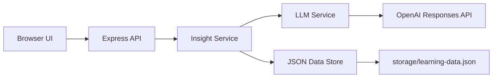

# Architecture Report

## 1. Muc tieu MVP

MVP nay tap trung vao bai toan hackday: chuyen mot chatbot hoi-dap thanh tro ly hoc tap co nho ngu canh hoc cua nguoi dung.

He thong can lam duoc 5 viec:

1. Tra loi ngan gon, de hieu.
2. Hoi lai muc do hieu sau moi cau tra loi.
3. Giai thich lai neu nguoi dung chua nam duoc.
4. Goi y huong hoc tiep neu nguoi dung da hieu.
5. Luu knowledge profile de ca nhan hoa cho lan sau.

## 2. Kien truc tong quan



## 3. Ly do chon kien truc nay

### Don gian de doc

- Khong dung framework frontend build phuc tap.
- Frontend dung HTML/CSS/ES modules, phuc vu nhanh cho demo hackday.
- Backend chi dung `Express` va chia theo layer ro rang.

### De mo rong

- `InsightService` la noi gom business flow, de sau nay doi sang database that hoac vector DB ma khong can sua UI.
- `LlmService` tach rieng de sau nay co the doi OpenAI, model khac, hoac them structured output chuan hon.
- `DataStore` tach rieng de doi tu JSON sang PostgreSQL/MongoDB.

### De maintain

- Moi file mang mot vai tro cu the.
- Khong de logic route, business va persistence tron vao nhau.
- Frontend tach thanh tung component thay vi viet mot file lon.

## 4. Luong xu ly chinh

### 4.1 User dat cau hoi

1. Frontend goi `POST /api/insight/ask`.
2. `InsightController` chuyen request vao `InsightService`.
3. `InsightService` detect topic dua tren `knowledgeBase`.
4. `LlmService` sinh cau tra loi + cau hoi kiem tra muc do hieu.
5. `DataStore` luu message, interaction va cap nhat user profile.
6. Snapshot moi duoc tra ve cho UI.

### 4.2 User phan hoi da hieu hay chua

1. Frontend goi `POST /api/insight/reflect`.
2. `InsightService` tim reflection dang pending.
3. Neu `partial` hoac `confused`, `LlmService` sinh giai thich de hon.
4. He thong them 3 cau hoi hoc tiep.
5. `DataStore` cap nhat knowledge gaps va thong ke hieu/chua hieu.

## 5. Cac module backend

### `src/routes`

- Dinh nghia API endpoints.

### `src/controllers`

- Validate input co ban.
- Chuyen request vao service.
- Tra ket qua JSON.

### `src/services/insightService.js`

- Trung tam nghiep vu cua app.
- Dieu phoi flow hoi, tra loi, reflect, cap nhat profile.
- Dong goi du lieu thanh snapshot phu hop cho frontend.

### `src/services/llmService.js`

- Neu co `OPENAI_API_KEY`, goi OpenAI Responses API.
- Neu khong, fallback sang local knowledge base de demo khong bi phu thuoc mang.

### `src/stores/dataStore.js`

- Quan ly file `storage/learning-data.json`.
- Tao session, append message, luu interaction, cap nhat profile.

## 6. Frontend structure

Frontend khong can build step. Tat ca nam trong `public/`:

- `app.js`: bootstrap app, wiring component.
- `services/apiClient.js`: goi backend.
- `state/appState.js`: state store nho cho UI.
- `components/conversationView.js`: render message, action reflect, suggestion chip.
- `components/profilePanel.js`: render learning profile.
- `components/chatComposer.js`: submit cau hoi.

Kieu tach nay giu UI de thay doi sau nay, vi state, API va rendering da tach.

## 7. Data model tom tat

### User profile

```json
{
  "userId": "demo-user",
  "preferredStyle": "short_clear_direct",
  "summary": {
    "totalQuestions": 3,
    "understoodCount": 1,
    "clarificationCount": 2
  },
  "topics": {
    "rag": {
      "topicLabel": "RAG",
      "questionsAsked": 2,
      "understoodCount": 1,
      "clarificationCount": 1,
      "knowledgeGaps": ["retrieval", "embedding"]
    }
  }
}
```

### Session

```json
{
  "sessionId": "session_xxx",
  "userId": "demo-user",
  "currentTopicLabel": "RAG",
  "messages": []
}
```

## 8. Huong mo rong sau hackday

- Doi `DataStore` sang PostgreSQL/MongoDB.
- Them vector DB cho semantic memory.
- Them auth va nhieu user that.
- Dung structured output schema chat che hon cho `LlmService`.
- Them analytics dashboard va spaced repetition.

## 9. Gioi han hien tai

- Detect topic hien dang dua nhieu vao keyword va knowledge base mau.
- Persistence dang la JSON local, phu hop demo hon production.
- Chua co auth.
- Chua co streaming response.

## 10. Cach demo nhanh

1. Mo web app.
2. Hoi: `RAG la gi?`
3. Chon `Can don gian hon`.
4. Boi canh se duoc giai thich lai va goi y 3 cau hoi tiep theo.
5. Bam vao mot suggestion de tiep tuc flow.
